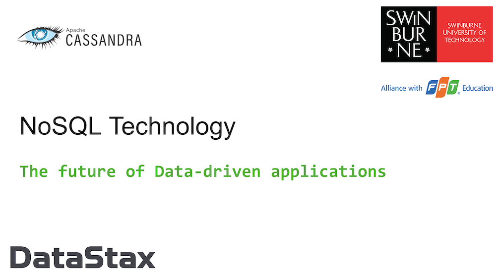

## 🎓 Workshop NoSQL: Apache Cassandra™ and AstraDB

[](https://discord.com/widget?id=685554030159593522&theme=dark)


⏲️ **Duration :** 3 hours

🎓 **Level** Beginner to Intermediate



> [🔖 Accessing HANDS-ON](#-start-hands-on)

## 📋 Table of contents

- [LAB1 - Initialize your environment](#lab1---initialize-your-environment)
- [LAB2 - First CQL Queries](#lab2-first-cql-queries)
- [LAB3 - Data Modeling](#lab3-datamodel)
- [LAB4 - Coding](#lab3---coding)
<p>

# 🏁 Start Hands-on

## LAB1 - Initialize your environment

#### `✅.setup-01`- Create your Astra Account: 

The Astra registration page should have opened with Gitpod, if not use [this link](https://astra.datastax.com)


#### `✅.setup-02`- Create Astra Credentials (token): Create an application token by following <a href="https://awesome-astra.github.io/docs/pages/astra/create-token/" target="_blank">these instructions</a>. 

Skip this step is you already have a token. You can reuse the same token in our other workshops, too.

> Your token should look like: `AstraCS:....`

#### `✅.setup-03`- Open Gitpod

Gitpod is an IDE based on VSCode deployed in the cloud.

> ↗️ _Right Click and select open as a new Tab..._

<a href="https://gitpod.io/#https://github.com/datastaxdevs/workshop-swinburne"></a>

#### `✅.setup-04`- Setup Astra CLI

When the gitpod open you are asked to provide a TOKEN:

> 🖥️ `setup-04 output`
>
> ```
> [cedrick.lunven@gmail.com]
> ASTRA_DB_APPLICATION_TOKEN=AstraCS:AAAAAAAA
> 
> [What's NEXT ?]
> You are all set.(configuration is stored in ~/.astrarc) You can now:
>    • Use any command, 'astra help' will get you the list
>    • Try with 'astra db list'
>    • Enter interactive mode using 'astra'
> 
> Happy Coding !
> ```

#### `✅.setup-05`- List your existing Users.

```bash
astra user list
```

> 🖥️ `setup-05 output`
>
> ```
> +--------------------------------------+-----------------------------+---------------------+
> | User Id                              | User Email                  | Status              |
> +--------------------------------------+-----------------------------+---------------------+
> | b665658a-ae6a-4f30-a740-2342a7fb469c | cedrick.lunven@datastax.com | active              |
> +--------------------------------------+-----------------------------+---------------------+
> ```

#### `✅.setup-06`- Create database `workshops` and keyspace `trollsquad` if they do not exist:

```bash
astra db create workshops -k sensor_data --if-not-exist --wait
```

Let's analyze the command:
| Chunk         | Description     |
|--------------|-----------|
| `db create` | Operation executed `create` in group `db`  |
| `workshops` | Name of the database, our argument |
|`-k sensor_data` | Name of the keyspace, a db can contains multiple keyspaces |
| `--if-not-exist` | Flag for itempotency creating only what if needed |
| `--wait` | Make the command blocking until all expected operations are executed (timeout is 180s) |

> **Note**: If the database already exist but has not been used for while the status will be `HIBERNATED`. The previous command will resume the db an create the new keyspace but it can take about a minute to execute.

> 🖥️ `setup-06 output`
>
> ```
> [INFO]  Database 'workshops' does not exist. Creating database 'workshops' with keyspace 'sensor_data'
> [INFO]  Database 'workshops' and keyspace 'sensor_data' are being created.
> [INFO]  Database 'workshops' has status 'PENDING' waiting to be 'ACTIVE' ...
> [INFO]  Database 'workshops' has status 'ACTIVE' (took 87975 millis)
> [OK]    Database 'workshops' is ready.
> ```

#### `✅.setup-07`- Get the informations for your database including the keyspace list

```bash
astra db get workshops
```

> 🖥️ `setup-08 output`
>
> ```
> +------------------------+-----------------------------------------+
> | Attribute              | Value                                   |
> +------------------------+-----------------------------------------+
> | Name                   | workshops                               |
> | id                     | bb61cfd6-2702-4b19-97b6-3b89a04c9be7    |
> | Status                 | ACTIVE                                  |
> | Default Cloud Provider | AWS                                     |
> | Default Region         | us-east-1                               |
> | Default Keyspace       | sensor_data                             |
> | Creation Time          | 2022-08-29T06:13:06Z                    |
> |                        |                                         |
> | Keyspaces              | [0] sensor_data                         |
> |                        |                                         |
> |                        |                                         |
> | Regions                | [0] us-east-1                           |
> |                        |                                         |
> +------------------------+-----------------------------------------+
> ```

*Congratulations your environment is all set, let's start the labs !*

## LAB2. First CQL Queries

#### ✅ Launch the initialization script

```
astra db cqlsh workshops -f initialize.cql
```

Now you can copy-paste any of the queries below and execute them with the `Enter` key:

#### ✅ Start the CQL shell and connect to database `workshops` and keyspace `sensor_data`:

```
astra db cqlsh workshops -k sensor_data
```

> 🖥️ Output
>
> ```
> [INFO]  Downloading Cqlshell, please wait...
> [INFO]  Installing  archive, please wait...
> [INFO]  Secure connect bundles have been downloaded.
> [INFO]  
> Cqlsh is starting, please wait for connection establishment...
> Connected to cndb at 127.0.0.1:9042.
> [cqlsh 6.8.0 | Cassandra 4.0.0.6816 | CQL spec 3.4.5 | Native protocol v4]
> Use HELP for help.
> token@cqlsh:sensor_data> 
> ```


CRUD stands for "**create, read, update, and delete**". Simply put, they are the basic types of commands you need to work with ANY database in order to maintain data for your applications.

#### ✅ (C)RUD = create = insert data, users

Our tables are in place so let's put some data in them. This is done with the **INSERT** statement. We'll start by inserting 2 rows into the **_networks_** table.

Copy and paste the following in your CQL Console:
_(Once you have carefully examined the first of the following **INSERT** statements below, you can simply copy/paste the others which are very similar.)_

📘 **Commands to execute**

```sql
INSERT INTO networks 
(bucket,name,description,region,num_sensors)
VALUES ('all','forest-net',
        'forest fire detection network',
        'south',3);
INSERT INTO networks 
(bucket,name,description,region,num_sensors)
VALUES ('all','volcano-net',
        'volcano monitoring network',
        'north',2);    
```

#### ✅ Step 6b. (C)RUD = create = insert data, posts

Let's run some more **INSERT** statements, this time for **sensors**. We'll insert data into the **_sensors_by_network_** table.

_(Once you have carefully examined the first of the following **INSERT** statements below, you can simply copy/paste the others which are very similar.)_

> _Note_: in the following, we are using `MAP<>` which lets you define you our key/value mapping, thereby adding a bit of flexibility -- Cassandra Data models are strongly typed.

📘 **Commands to execute**

```sql
INSERT INTO sensors_by_network 
(network,sensor,latitude,longitude,characteristics)
VALUES ('forest-net','s1001',30.526503,-95.582815,
       {'accuracy':'medium','sensitivity':'high'});
INSERT INTO sensors_by_network 
(network,sensor,latitude,longitude,characteristics)
VALUES ('forest-net','s1002',30.518650,-95.583585,
       {'accuracy':'medium','sensitivity':'high'});     
INSERT INTO sensors_by_network 
(network,sensor,latitude,longitude,characteristics)
VALUES ('forest-net','s1003',30.515056,-95.556225,
       {'accuracy':'medium','sensitivity':'high'});     
INSERT INTO sensors_by_network 
(network,sensor,latitude,longitude,characteristics)
VALUES ('volcano-net','s2001',44.460321,-110.828151,
       {'accuracy':'high','sensitivity':'medium'});    
INSERT INTO sensors_by_network 
(network,sensor,latitude,longitude,characteristics)
VALUES ('volcano-net','s2002',44.463195,-110.830124,
       {'accuracy':'high','sensitivity':'medium'});     
```

Ok, we have a lovely bunch of sensors in our application.

Now let's add temperature measurements in table **_temperatures_by_sensors_** as well! Let's do it with the following command (please note that the `INSERT` statements are similar to the ones seen above, with different columns and table name):

> _Note_: In a relational database you may have use a join on 3 tables `Networks > Sensors > Temperatures`. In the following, we are putting back the network name in temperature table and this is because it will be required in the where clause.

📘 **Commands to execute**

```sql
INSERT INTO sensors_by_network 
(network,sensor,latitude,longitude,characteristics)
VALUES ('forest-net','s1001',30.526503,-95.582815,
       {'accuracy':'medium','sensitivity':'high'});
INSERT INTO sensors_by_network 
(network,sensor,latitude,longitude,characteristics)
VALUES ('forest-net','s1002',30.518650,-95.583585,
       {'accuracy':'medium','sensitivity':'high'});     
INSERT INTO sensors_by_network 
(network,sensor,latitude,longitude,characteristics)
VALUES ('forest-net','s1003',30.515056,-95.556225,
       {'accuracy':'medium','sensitivity':'high'});     
INSERT INTO sensors_by_network 
(network,sensor,latitude,longitude,characteristics)
VALUES ('volcano-net','s2001',44.460321,-110.828151,
       {'accuracy':'high','sensitivity':'medium'});    
INSERT INTO sensors_by_network 
(network,sensor,latitude,longitude,characteristics)
VALUES ('volcano-net','s2002',44.463195,-110.830124,
       {'accuracy':'high','sensitivity':'medium'});    
```

#### ✅ C(R)UD = read = read data

Now that we've inserted a set of rows (two sets, to be precise), let's take a look at how to read the data back out. This is done with a **SELECT** statement. In its simplest form we could just execute a statement like the following **_**cough_** **_**cough_**:

```sql
SELECT * FROM networks;
```

```
 name        | description                   | region
-------------+-------------------------------+--------
  forest-net | forest fire detection network |  south
 volcano-net |    volcano monitoring network |  north
```

or

```sql
SELECT * FROM sensors_by_network;
```

📗 **Expected output**

```
token@cqlsh:sensor_data> SELECT * FROM sensors_by_network;

 network     | sensor | characteristics                               | latitude  | longitude
-------------+--------+-----------------------------------------------+-----------+-------------
  forest-net |  s1001 | {'accuracy': 'medium', 'sensitivity': 'high'} | 30.526503 |  -95.582815
  forest-net |  s1002 | {'accuracy': 'medium', 'sensitivity': 'high'} | 30.518650 |  -95.583585
  forest-net |  s1003 | {'accuracy': 'medium', 'sensitivity': 'high'} | 30.515056 |  -95.556225
 volcano-net |  s2001 | {'accuracy': 'high', 'sensitivity': 'medium'} | 44.460321 | -110.828151
 volcano-net |  s2002 | {'accuracy': 'high', 'sensitivity': 'medium'} | 44.463195 | -110.830124
```

You may have noticed my coughing fit a moment ago. Even though you can execute a **SELECT** statement with no partition key defined, this is NOT something you should do when using Apache Cassandra. We are doing it here for illustration purposes only and because our whole dataset is just a handful of values.

Given the data we inserted earlier, a more proper statement would be something like (while we are at it, we also explicitly specify which columns we want back):

```sql
SELECT sensor, characteristics, latitude, longitude 
FROM sensors_by_network
WHERE network = 'forest-net';
```

📗 **Expected output**

```
token@cqlsh:sensor_data> SELECT sensor, characteristics, latitude, longitude
               ... FROM sensors_by_network
               ... WHERE network = 'forest-net';

 sensor | characteristics                               | latitude  | longitude
--------+-----------------------------------------------+-----------+------------
  s1001 | {'accuracy': 'medium', 'sensitivity': 'high'} | 30.526503 | -95.582815
  s1002 | {'accuracy': 'medium', 'sensitivity': 'high'} | 30.518650 | -95.583585
  s1003 | {'accuracy': 'medium', 'sensitivity': 'high'} | 30.515056 | -95.556225
 ```

The key is to ensure we are **always selecting by some partition key** at a minimum, so to avoid the dreaded _full-cluster scans_ which yield performances that are generally unacceptable in production.

Ok, with that out of the way we can **READ** the data from the other table as well - remember we **INSERT**ed on both tables?

📘 **Commands to execute**

```sql
SELECT * FROM temperatures_by_sensor;

SELECT timestamp, value 
FROM temperatures_by_sensor
WHERE sensor='s1002' 
AND date='2020-07-05';
```

(again, in the second **SELECT** we specify some columns - it is something we may want to do in most cases).


📗 **Expected output**

```
token@cqlsh:sensor_data> select timestamp, value from temperatures_by_sensor where sensor='s1002' and DATE='2020-07-05';

 timestamp                       | value
---------------------------------+-------
 2020-07-05 12:59:59.000000+0000 |    99
 2020-07-05 12:00:01.000000+0000 |   100
 2020-07-05 00:59:59.000000+0000 |    82
 2020-07-05 00:00:01.000000+0000 |    82
```

Once you execute the above **SELECT** statements you should see something like the expected output above. We have now **READ** the data we **INSERTED** earlier. Awesome job!

📘 **Commands to execute**

```sql
SELECT * FROM temperatures_by_sensor
WHERE sensor='s1002';
```

📗 **Expected output**

Suprise !

## LAB3. DataModel

```sql
CREATE TABLE IF NOT EXISTS networks (
  bucket          TEXT,
  name            TEXT,
  description     TEXT,
  region          TEXT,
  num_sensors     INT,
  PRIMARY KEY ((bucket), name)
);

CREATE TABLE IF NOT EXISTS temperatures_by_network (
  network TEXT,
  week DATE,
  date_hour TIMESTAMP,
  sensor TEXT,
  avg_temperature FLOAT,
  latitude DECIMAL,
  longitude DECIMAL,
  PRIMARY KEY ((network,week),date_hour,sensor)
) WITH CLUSTERING ORDER BY (date_hour DESC, sensor ASC);

CREATE TABLE IF NOT EXISTS sensors_by_network (
  network TEXT,
  sensor TEXT,
  latitude DECIMAL,
  longitude DECIMAL,
  characteristics MAP<TEXT,TEXT>,
  PRIMARY KEY ((network),sensor)
);

CREATE TABLE IF NOT EXISTS temperatures_by_sensor (
  sensor TEXT,
  date DATE,
  timestamp TIMESTAMP,
  value FLOAT,
  PRIMARY KEY ((sensor,date),timestamp)
) WITH CLUSTERING ORDER BY (timestamp DESC);
```

### Execute a few queries

```sql
-- Q1 (note 'all' is the only partition key in this table)
SELECT  name, description, region, num_sensors
FROM    networks
WHERE   bucket = 'all';

-- Q2
SELECT  date_hour, avg_temperature, latitude, longitude, sensor 
FROM    temperatures_by_network
WHERE   network    = 'forest-net'
  AND   week       = '2020-07-05'
  AND   date_hour >= '2020-07-05'
  AND   date_hour  < '2020-07-07';

-- Q3
SELECT  *
FROM    sensors_by_network
WHERE   network = 'forest-net';

-- Q4
SELECT  timestamp, value 
FROM    temperatures_by_sensor
WHERE   sensor = 's1003'
  AND   date   = '2020-07-06';
```

To close `cqlsh` and get back to the shell prompt, execute the `EXIT` command.

## LAB4. Coding Java and Python

#### ✅ Download the Secure Connect Bundle

Besides the "Client ID" and the "Client Secret" from the Token, the drivers also need the "Secure Connect Bundle" zipfile to work (it contains proxy and routing information as well as the necessary certificates). To download it:

```
astra db download-scb -f secure-connect-workshops.zip workshops
```

You can check it has been saved with `ls *.zip`.

#### ✅ Configure the dot-env file

Copy the template dot-env and edit it with:

```
cp .env.sample .env ; gp open .env
```

Replace Client Secret strings from the database Token.

Finally, `source` the .env file:

```bash
source .env
```

Choose your path:

[](python/Python_README.md)

[](java/Java_README.md)

